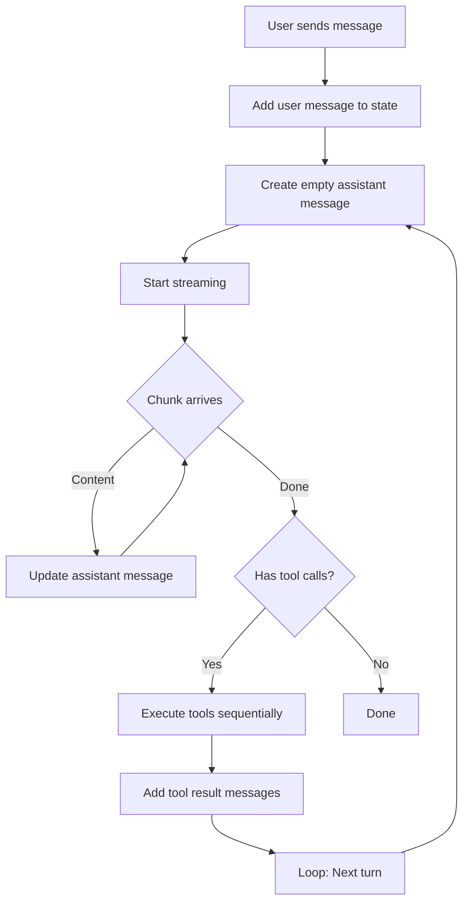

# Streaming Implementation Specification

## Problem Statement

Current streaming implementation causes visual glitches:
- Messages flicker and reset during streaming
- Code blocks render incompletely and re-render rapidly
- Tool calls interrupt streaming flow
- State updates race with incoming chunks

## Root Causes

1. **State Mutation**: Directly mutating arrays/objects confuses React's reconciliation
2. **Ref/State Desync**: `messagesRef` and `messages` state get out of sync
3. **Batching Issues**: React 19's automatic batching conflicts with rapid updates
4. **Async Closures**: `onChunk` callback captures stale state

## Solution Architecture

### 1. Single Source of Truth Pattern

```typescript
// ❌ BAD: Dual state management
const [messages, setMessages] = useState([]);
const messagesRef = useRef([]);

// ✅ GOOD: Single state with functional updates
const [messages, setMessages] = useState([]);
```

**Rationale**: Eliminate synchronization bugs by having only one state container.

### 2. Immutable Updates with Functional setState

```typescript
// ❌ BAD: Mutation
const onChunk = (content: string) => {
  currentMessages[msgIndex].content += content;
  setMessages([...currentMessages]);
};

// ✅ GOOD: Functional update with immutability
const onChunk = (content: string) => {
  setMessages(prev => {
    const updated = prev.map(msg =>
      msg.id === assistantId
        ? { ...msg, content: (msg.content || '') + content }
        : msg
    );
    return updated;
  });
};
```

**Rationale**: Functional updates always work with the latest state, preventing race conditions.

### 3. Message Identity Tracking

```typescript
// Create assistant message with stable ID before streaming
const assistantId = crypto.randomUUID();

// Add placeholder immediately
setMessages(prev => [...prev, {
  id: assistantId,
  role: 'assistant',
  content: '',
  toolCalls: undefined,
}]);

// Update by ID during streaming
const onChunk = (content: string) => {
  setMessages(prev =>
    prev.map(msg =>
      msg.id === assistantId
        ? { ...msg, content: (msg.content || '') + content }
        : msg
    )
  );
};
```

**Rationale**: Stable IDs allow React to track the same message through updates without remounting.

### 4. SSE Parser with Accumulation

```typescript
async function streamResponse(
  apiUrl: string,
  payload: object,
  signal: AbortSignal,
  onChunk: (content: string) => void
): Promise<{ content: string; toolCalls?: any }> {
  const response = await fetch(apiUrl, {
    method: 'POST',
    headers: { 'Content-Type': 'application/json' },
    body: JSON.stringify(payload),
    signal,
  });

  if (!response.body) throw new Error('No response body');

  const reader = response.body.getReader();
  const decoder = new TextDecoder();

  let buffer = '';
  let fullContent = '';
  let toolCalls = undefined;

  while (true) {
    const { done, value } = await reader.read();
    if (done) break;

    buffer += decoder.decode(value, { stream: true });

    // Process complete SSE messages
    const lines = buffer.split('\n\n');
    buffer = lines.pop() || ''; // Keep incomplete message in buffer

    for (const line of lines) {
      if (!line.startsWith('data: ')) continue;

      const data = line.slice(6).trim();
      if (data === '[DONE]') continue;

      try {
        const json = JSON.parse(data);
        const delta = json?.choices?.[0]?.delta;

        if (delta?.content) {
          fullContent += delta.content;
          onChunk(delta.content); // Incremental UI update
        }

        if (delta?.tool_calls) {
          toolCalls = delta.tool_calls;
        }
      } catch {
        // Skip malformed JSON
      }
    }
  }

  return { content: fullContent, toolCalls };
}
```

**Rationale**: Proper buffering prevents partial JSON parsing and ensures clean chunk delivery.

### 5. Tool Execution Flow



**Key Rules**:
- Never mutate messages during tool execution
- Always append new messages for tool results
- Use `setMessages(prev => [...prev, newMsg])` pattern

### 6. Code Block Handling

**Problem**: Markdown parsers re-render entire block on each chunk, causing flicker.

**Solution**: Use a stable key for code blocks and memoize rendering:

```typescript
const CodeBlock = React.memo(({ children, className }) => {
  const language = className?.replace('language-', '');
  return (
    <SyntaxHighlighter language={language}>
      {children}
    </SyntaxHighlighter>
  );
}, (prevProps, nextProps) => {
  // Only re-render if content actually changed
  return prevProps.children === nextProps.children;
});
```

### 7. Anti-Patterns to Avoid

```typescript
// ❌ DON'T: Push mutations
currentMessages.push(newMsg);
setMessages(currentMessages); // Same reference!

// ❌ DON'T: Direct property mutation
currentMessages[index].content += chunk;
setMessages([...currentMessages]); // Creates new array but objects are same!

// ❌ DON'T: Mix ref and state updates
messagesRef.current = updated;
setMessages(updated); // Desync risk

// ❌ DON'T: Capture state in closure
const onChunk = (content) => {
  const msg = messages.find(m => m.id === id); // Stale!
  msg.content += content;
};
```

### 8. Implementation Checklist

- [ ] Remove all `messagesRef` usage
- [ ] Convert all state updates to functional form `setMessages(prev => ...)`
- [ ] Ensure all objects are immutably updated `{ ...obj, field: newValue }`
- [ ] Use `.map()` instead of array index access for updates
- [ ] Add stable `key` props to all list items
- [ ] Test with React DevTools Profiler to verify no unnecessary re-renders
- [ ] Test with slow network throttling to catch timing bugs

### 9. Testing Strategy

**Manual Tests**:
1. Send a message and watch Network tab - should see chunks arriving progressively
2. Observe message appearing character-by-character without resets
3. Upload a file and ask for summary - tools should execute smoothly
4. Ask for code examples - code blocks should render once, not flicker

**Automated Tests**:
1. Mock SSE stream with delays between chunks
2. Assert message content only grows, never shrinks
3. Assert no duplicate messages appear
4. Assert message object references change on updates (immutability)

## Success Criteria

✅ Text streams smoothly without visual resets
✅ Code blocks render progressively without flickering
✅ Tool calls execute mid-stream without disrupting display
✅ No console errors about state updates
✅ React DevTools shows minimal re-renders
